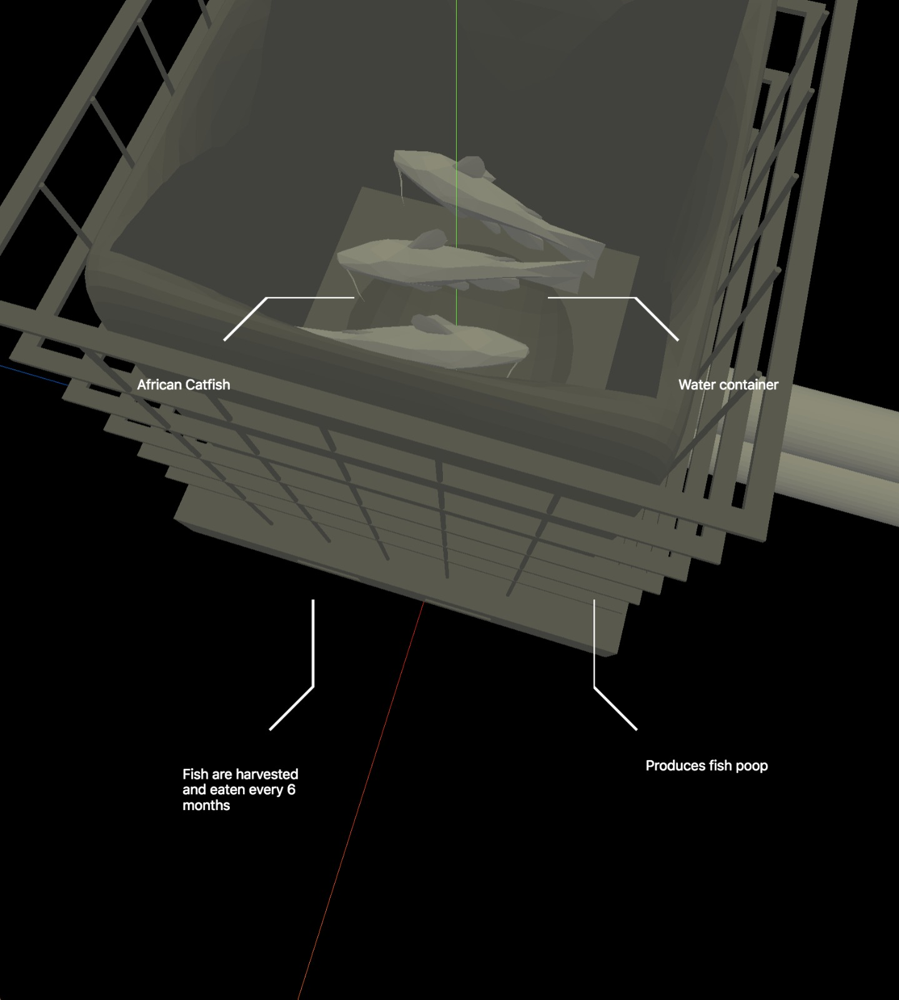

# Project 3

## Café de Ceuvel

# Table of Contents

*   [Getting Started](#getting-started)
*   [Overview](#overview)
*   [Design Challenge](#design-challenge)
*   [User Scenario](#user-scenario)
*   [Requirements](#requirements-for-success)
*   [Challenges](#challenges)
*   [Technical Stack](#the-technical-stack)

## Getting Started

1.  Clone the repository
2.  Run `yarn install`
3.  Run `yarn run start` to boot up the project
4.  Visit the project [at localhost:3000](localhost:3000)
5.  Run `yarn run build` to build the project to the /dist folder

---

## Overview

This is the third project of the Everything Web minor, a project done by [Mees](https://github.com/meesrutten), [Mo](https://github.com/moniac) & [Servin](https://github.com/servinlp).

The challenge here is to implement data provided by Cafe de Ceuvel and make a product that can inform and entertain visitors about the self-sustaining fish tank.

## Design Challenge

Hoe kunnen wij, door middel van een interactieve applicatie, de gasten/bezoekers van de Ceuvel inzicht geven in hun duurzame productie van vis en groente.

## User Scenario

The demographic we are making this project for are the customers that come to eat a meal. We specifically want to target the time spent waiting between ordering and receiving the meal.

We think that this is the best time to offer a interactive experience to the customers.

The User Scenario

A group of friends enter the restaurant. They know that the café has a sustainable model that is good for the fishes, but they don't know anything about iy beyond that.

They are brought to their table and have had the time to look over the menu. They have ordered a meal and are now waiting on said meal.

One of them notices a QR code on the table, and pulls out their smartphone to scan the QR code.

Scanning the code opens up the browser on the phone and brings you to the project website.

Once on the website, you can see a general overview of the current state of the sustaining model. The overview is based on real time data, for example showing the amount of fish, plants, the status.

Added to that, you can see the effects of your order on the self sustaining economy.

The customers now have a better insight into what their participation means for the self sustaining economy.

## Requirements for success

1.  The project informs visitors of the self sustaining model.
2.  The project shortens the perceived time visitors experience when waiting for a meal.

## Challenges

*   How can we have users navigate to different parts of a 3d object?
*   How can we shorten the perceived time users spend waiting for their meal?
*   What's the quickest way to make/find models for the project?

## The Technical Stack

*   Tooling made by Mo, [available separately here](https://github.com/moniac/es8-postcss-boilerplate)
*   Three.js
*   GSAP for animations

## License

This project uses the MIT license, for more information, please check the LICENSE file in this repo.
